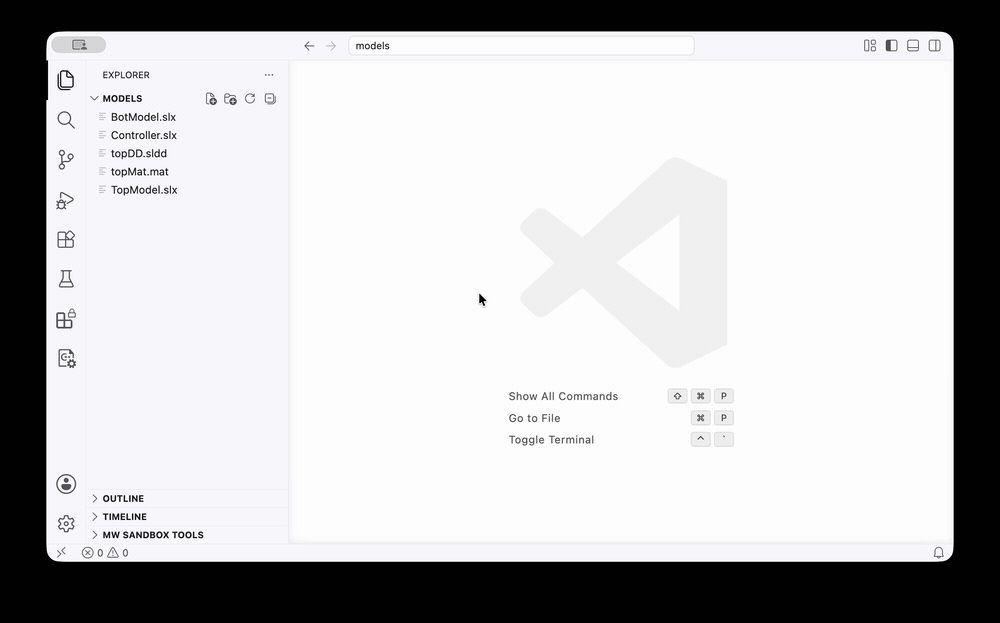

# Simulink Data Explorer Extension for Visual Studio Code

**Explore Simulink&reg; models, data dictionaries, and projects directly in Visual Studio Code — no MATLAB&reg; or Simulink installation required.** Simulink Data Explorer reads `.slx`, `.sldd`, `.mat`, and `.prj` files directly, so you can browse their contents and relationships anywhere VS Code runs.

It adds a native experience for Simulink file types — a **Simulink Data Explorer sidebar** that maps how your models, dictionaries, and projects relate, a **table editor** to browse the contents of each file, and a **Properties panel** to inspect the selected entry — without leaving your editor. Textual (JSON) `.sldd` dictionaries are **editable** directly in the table; other formats open read-only.



## Features

- **Relationship tree** — a dedicated activity-bar view that scans the workspace and renders how files relate: models referencing other models, models linked to data dictionaries (`.sldd`) and MAT-files (`.mat`), and dictionaries referencing other dictionaries. Entries expand lazily as you drill in.
- **Project & folder grouping** — the tree groups top-level entries by MATLAB Project (`.prj`) or by containing folder, so files with the same name in different folders stay distinct. References resolve within a group first.
- **Health decorations** — tree rows are badged for at-a-glance status: circular references, orphaned dictionaries/MAT-files (nothing links to them), unsaved modifications, and unresolved (missing) references.
- **Table editor** — open a model, dictionary, MAT-file, or project in a spreadsheet-style, tree-structured table. Sections are always shown (e.g. a dictionary's Design Data, Architectural Data, Configurations, Other Data), even when empty.
- **Editing for textual `.sldd`** — edit a textual (JSON) data dictionary directly in the table: change entry values and names, add child elements, and cut/copy/paste/delete entries via the right-click context menu. Edits write back to the JSON file, so **undo/redo, the dirty indicator, and save are all native** and stay in sync with the built-in text view. Binary `.sldd`, `.slx`, `.mat`, and `.prj` open read-only.
- **Live two-way sync** — because a textual `.sldd` is backed by its JSON text document, edits in the table and edits in the JSON text editor update each other instantly, and there is a single shared undo history across both views.
- **Properties panel** — a selection-following webview that shows the full properties of the entry selected in the table. It lives in its own view container and can be docked in the secondary sidebar.
- **Search** — filter entries by name using the table's built-in filter bar as you type.
- **Dual view for textual `.sldd`** — because a textual `.sldd` is JSON, you can switch to Visual Studio Code's built-in JSON text editor at any time via **Reopen Editor With…**.
- **Theme-aware** — every pane follows your active Visual Studio Code color theme (light, dark, or high-contrast).

## Getting Started

1. Install the extension. Download the latest `.vsix` from the
   [Releases page](https://github.com/mathworks/data-explorer-vscode/releases),
   then install it either from the command line:

   ```sh
   code --install-extension data-explorer-vscode-<version>.vsix
   ```

   or from within VS Code via the Extensions view → **⋯** menu →
   **Install from VSIX…**.
2. Open a folder or workspace that contains Simulink files.
3. Click the **Simulink Data Explorer** icon in the activity bar to see the relationship tree.
4. Open any supported file (`.slx`, `.sldd`, `.mat`, `.prj`) — it opens in the Data Explorer table by default. Select a row to inspect it in the Properties panel.

For a textual `.sldd`, you can switch to the raw JSON via **View: Reopen Editor With… → Text Editor** (or right-click the editor tab → **Reopen Editor With…**).

## Supported Files

**Editable in the table:**

- **Simulink Data Dictionaries (textual)** — textual (JSON) `.sldd`: edit values and names, add children, and cut/copy/paste/delete entries, with native undo/redo and save.

**Viewing (read-only):**

- **Simulink models** — `.slx`
- **Simulink Data Dictionaries (binary)** — compressed `.sldd`
- **MAT-files** — `.mat`
- **MATLAB Projects** — `.prj`

## Requirements

- Visual Studio Code 1.90.0 or later.

No MATLAB&reg; or Simulink installation is required to view or edit files — Simulink Data Explorer reads and writes the files directly.

## Known Limitations

- Editing is supported only for **textual (JSON) `.sldd`**. Binary `.sldd`, `.slx`, `.mat`, and `.prj` are read-only.
- Paste creates a new top-level entry in the target section; pasting as a child of a struct/bus is not yet supported.
- Reference resolution matches files by name (basename), preferring the referrer's own project or folder. Two `.prj` files in the same directory are not supported.
- `.m` files are not scanned, so a project whose members are only `.m` files appears as an empty group.

## License

Distributed under the BSD 3-Clause License. See [LICENSE](LICENSE) for details.

---

MATLAB and Simulink are registered trademarks of The MathWorks, Inc. See [www.mathworks.com/trademarks](https://www.mathworks.com/trademarks) for a list of additional trademarks. Other product or brand names may be trademarks or registered trademarks of their respective holders.

Copyright 2026 The MathWorks, Inc.
