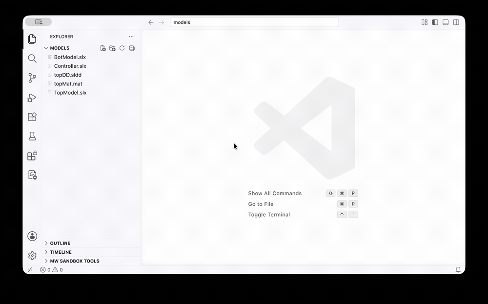

# Simulink Data Explorer Extension for Visual Studio Code

**Explore Simulink&reg; models, data dictionaries, and projects directly in Visual Studio Code — no MATLAB&reg; or Simulink installation required.** Simulink Data Explorer reads `.slx`, `.mdl`, `.sldd`, `.mat`, and `.prj` files itself, so it works anywhere VS Code runs, including machines and CI agents with no MATLAB install. It adds a **relationship tree** that maps how your files reference each other, a **table editor** for browsing and editing their contents, and a **Properties panel** for the selected entry.



## Features

### Navigate & understand your models

- **Relationship tree** — a dedicated activity-bar view that scans the workspace and renders how files relate: models referencing other models, models linked to data dictionaries (`.sldd`) and MAT-files (`.mat`), and dictionaries referencing other dictionaries. Entries expand lazily as you drill in.
- **Jump-to-reference links** — a model's Model References and External Data render as clickable links; selecting one opens the referenced model, dictionary, or MAT-file, resolved from your workspace. A reference to a file your workspace doesn't contain shows as unresolved.
- **Project & folder grouping** — the tree groups top-level entries by MATLAB Project (`.prj`) or by containing folder, so files with the same name in different folders stay distinct. References resolve within a group first.
- **Health decorations** — tree rows are badged for at-a-glance status: circular references, orphaned dictionaries/MAT-files (nothing links to them), unsaved modifications, and unresolved (missing) references.

### Browse & edit file contents

- **Table editor** — open a model, dictionary, MAT-file, or project in a spreadsheet-style, tree-structured table. Sections are always shown (e.g. a dictionary's Design Data, Architectural Data, Configurations, Other Data), even when empty.
- **Editing for `.sldd`** — edit a data dictionary directly in the table: change entry values and names, add child elements, and cut/copy/paste/delete entries via the right-click context menu, with **undo/redo, a dirty indicator, and save**.
- **Live two-way sync with the JSON editor (textual `.sldd`)** — a textual `.sldd` is backed by its JSON text document, so you can switch to Visual Studio Code's built-in text editor at any time via **Reopen Editor With…**. Edits in the table and edits in the JSON update each other instantly, and there is a single shared undo history across both views.
- **Properties panel** — a selection-following webview that shows the full properties of the entry selected in the table. It lives in its own view container in the secondary sidebar, and can be dragged anywhere else — activity bar or panel — like any other view.
- **Variable Editor for matrix values** — a value with two or more dimensions stays a short descriptor in its cell (`<2x3x2 double>`) with a grid glyph beside it; clicking the glyph opens the whole array in a floating spreadsheet-style grid, laid out the way MATLAB displays it. Anything above rank 2 gets a `(:,:,k)` page selector to step through its trailing dimensions. Available from both the table and the Properties panel; view-only.
- **Search** — the table's filter bar turns each condition you type and commit with <kbd>Enter</kbd> into a chip you can remove with its `×`; the `×` at the right end of the box clears the whole search. Scope a condition to one column by naming that column's header exactly as the header spells it — `Name:gain`, `Data Type=double`, `Value>10` — or right-click any column header to build the same thing from a popup, which shows you the text it writes. The operators are `:` (contains), `=`, `!=` (also `~=`), `>`, `<`, `>=` and `<=`, and spaces around one are ignored, so `Data Type: double` and `Value > 5` each read as a single condition. Quote a *value* that contains a space (`Name:"my var"`); a header's own space needs no quoting. Quoting only groups words, so `value:"5"` matches any value *containing* 5 — to ask for exactly 5, use `Value=5`.
- **Workspace-wide search** — **Data Explorer: Search Data Source Entries** (<kbd>Ctrl</kbd>/<kbd>Cmd</kbd>+<kbd>Alt</kbd>+<kbd>E</kbd>) searches every data source at once and lists each match with the file it comes from. A model's blocks are listed one hit per block, qualified by the subsystem the block sits in — so the several blocks named `Gain` a model may hold stay distinguishable, and the subsystem name is searchable too.
- **Usage column, both directions** — a dictionary entry, MAT variable, or model-workspace variable lists the blocks that read it, qualified by the model they are in; a block's row shows which of its parameters resolved where (`Gain=Kp (params.sldd)`). Either link navigates to the other side. Resolution follows MATLAB: the mask parameters of the masked subsystems a block sits inside come first, then the model workspace, then the linked data dictionary and any dictionary it references, then linked MAT-files — so a `Gain = g1` inside a mask reads as the mask's own `g1` (`Gain=g1 (MulAdd)`), and the value that mask parameter was given is credited to the masked block.
- **Block paths in the table** — where a model's blocks share a name, each row's Name shows the subsystem it lives in (`Gain (Controller)`), and hovering a block in the Usage column shows that block's full path.
- **Theme-aware** — every pane follows your active Visual Studio Code color theme (light, dark, or high-contrast).

## Getting Started

1. Install **Simulink Data Explorer** from the
   [Visual Studio Code Marketplace](https://marketplace.visualstudio.com/items?itemName=mathworks.simulink-data-explorer):
   open the Extensions view (<kbd>Ctrl</kbd>/<kbd>Cmd</kbd>+<kbd>Shift</kbd>+<kbd>X</kbd>),
   search for *Simulink Data Explorer*, and click **Install**. Or, from the command line:

   ```sh
   code --install-extension mathworks.simulink-data-explorer
   ```
2. Open a folder or workspace that contains Simulink files.
3. Click the **Simulink Data Explorer** icon in the activity bar to see the relationship tree.
4. Open any supported file — it opens in the Data Explorer table by default. Select a row to inspect it in the Properties panel.

### Optional: install from a `.vsix`

If you'd rather install a specific build by hand — for an air-gapped machine, or to
pick up a release before it reaches the Marketplace — download the `.vsix` from the
[Releases page](https://github.com/mathworks/data-explorer-vscode/releases) and
install it either from the command line:

```sh
code --install-extension simulink-data-explorer-<version>.vsix
```

or from within VS Code via the Extensions view → **⋯** menu → **Install from VSIX…**.

## Supported Files

| Files | Formats | In the table |
| --- | --- | --- |
| Simulink data dictionaries | `.sldd` — textual (JSON) and compressed-binary | **Editable** |
| Simulink models | `.slx`, `.mdl` — the modern text format and the classic pre-R2012 format | Read-only |
| MAT-files | `.mat` — Level 5, i.e. `-v6`/`-v7` | Read-only |
| MATLAB Projects | `.prj` | Read-only |

## Requirements

Visual Studio Code 1.106.0 or later. Nothing else — Simulink Data Explorer reads and writes these files directly.

## Known Limitations

- `.mat` support covers the Level 5 format only. **`-v7.3`** files, which are HDF5 and are what MATLAB requires for variables above 2 GB, are reported as unsupported rather than opened.
- Large textual (JSON) `.sldd` files are limited by size. Above **50 MB**, the file opens as a **read-only** table (VS Code cannot mirror a document that large for editing). Above **512 MB**, it cannot be rendered as a table at all and opens in VS Code's built-in **text editor** instead.
- Paste creates a new top-level entry in the target section; pasting as a child of a struct/bus is not yet supported.
- Reference resolution matches files by name (basename), preferring the referrer's own project or folder. Two `.prj` files in the same directory are not supported.
- `.m` files are not scanned, so a project whose members are only `.m` files appears as an empty group.

## Feedback

Please open an issue on the [GitHub repository](https://github.com/mathworks/data-explorer-vscode) to report a bug or request a feature. If the extension is useful to you, a rating or review on the Marketplace helps others find it.

## License

Distributed under the BSD 3-Clause License. See [LICENSE](LICENSE) for details.

---

MATLAB and Simulink are registered trademarks of The MathWorks, Inc. See [www.mathworks.com/trademarks](https://www.mathworks.com/trademarks) for a list of additional trademarks. Other product or brand names may be trademarks or registered trademarks of their respective holders.

Copyright 2026 The MathWorks, Inc.
